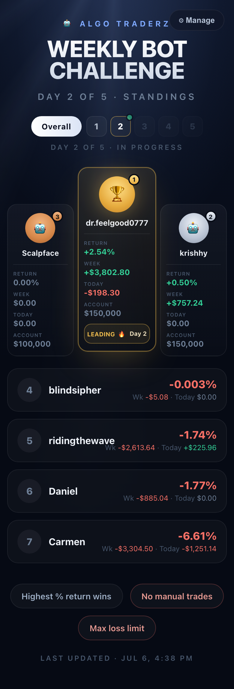

# Algo Traderz — Bot Challenge

A weekly bot-trading leaderboard built from **public TopstepX share links**, served as a
static [GitHub Pages](https://pages.github.com/) site.

- **Rank:** highest **% return on account size** wins (`-$2,559 / $150,000 = -1.71%`).
- **Week:** every week resets to 0 and follows the futures session clock, **Sunday 3pm →
  Friday 2pm** (5 daily sessions of 3pm → 2pm; the account size is snapped from the balance).
- **Day navigation:** click any day to see that session's standings; the current, unfinished
  day updates **in motion**. Each card shows **week-to-date** and **today's** P&L.
- **Rank by:** a toggle switches the ordering between **% return** and **raw $ P&L**, within
  whatever time window (Overall or a single day) is selected.
- **Data:** read straight from TopstepX's public JSON API — no login, no browser, no
  password / API key / cookie. Only the numeric account id from a shared stats page is used.
- **Inputs:** literally just a **share link + name** per competitor. Everything else
  (account size, P&L, % return, which day it is) is derived.



## How it works

A shared stats page — `https://topstepx.com/share/stats?share=24801853` — is backed by a
public API at `userapi.topstepx.com` keyed only by that `share` number (the trading account
id). Responses are CORS-open and unauthenticated, so the same code runs two ways:

- **Published board** — a GitHub Action runs the scrape server-side, commits
  `data/leaderboard.json`, and deploys the static page.
- **Live "Manage" panel** — the page fetches the API directly in the browser, so anyone can
  paste a share link and see it ranked instantly (saved to their device + a shareable link).

```
participants.json ──> src/scrape-shares.mjs ──> data/leaderboard.json ──> index.html
     (config)          (fetch public API)          (committed data)        (static page)
```

| File | Role |
| --- | --- |
| `src/topstep-api.mjs` | Fetch client: `parseAccountId`, `fetchAccountStats`, `fetchWeeklyStats`. |
| `src/calendar.mjs` | Futures trading calendar → current day, session window (`weekSchedule`). |
| `src/leaderboard.mjs` | Per-day + overall metrics, ranking, scope flattening. |
| `src/scrape-shares.mjs` | Reads config, ranks everyone, writes `data/leaderboard.json`. |
| `src/serve.mjs` | Tiny local preview server (`npm run serve`). |
| `index.html` | The static standings page (day tabs + Manage panel). |

`index.html` imports the `src/*.mjs` modules directly, so the browser and the Node scrape
share the exact same math.

## Configure competitors

Edit `participants.json` (or use the ⚙ **Manage** button on the page):

```json
{
  "challenge": {
    "title": "Bot Challenge",
    "org": "Algo Traderz",
    "rules": ["Highest % return wins", "No manual trades", "Max loss limit"]
  },
  "participants": [
    { "name": "alice", "url": "https://topstepx.com/share/stats?share=24801853" },
    { "name": "bob",   "url": "https://topstepx.com/share/stats?share=24800000" }
  ]
}
```

Each competitor is just a **name** (their Discord username) and a public share **url**
(or `accountId`). Account size, P&L and % return are all pulled from the share.

### Players add themselves in Discord (no login, no maintainer)

Competitors run **`/join <TopstepX share link>`** in the Discord server. A small
Cloudflare Worker bot ([`bot/`](bot/)) keys each entry to their Discord id and stores it,
so managing a link works from any device with nothing to install — `/link` to update,
`/mylink` to check, `/leave` to drop out. Both the live board and the Node scrape merge
that roster over the `participants.json` seed via `src/roster.mjs` (set `ROSTER_ENDPOINT`
to the deployed Worker's `/roster` URL). The site's ⚙ **Manage** panel just shows the
commands + current roster. See [`bot/README.md`](bot/README.md) for setup.

To pin a fixed competition window instead of the live week, add ISO `weekStart` / `weekEnd`
to `challenge`. Override the account-size tiers with `challenge.accountSizes` if needed.

## Run locally

```bash
npm run scrape   # fetch the public API -> data/leaderboard.json + .csv
npm run serve    # http://localhost:8787
```

No dependencies to install — everything uses Node's built-in `fetch`.

## Deploy to GitHub Pages

1. Push this folder to a GitHub repo.
2. **Settings → Pages → Build and deployment → Source: GitHub Actions.**
3. `.github/workflows/leaderboard.yml` re-runs the scrape every 15 minutes (and on push),
   rebuilds `data/leaderboard.json`, and deploys the static site. Tune the `cron` to taste.

```bash
git init && git add -A && git commit -m "Bot Challenge leaderboard"
git branch -M main
git remote add origin git@github.com:<you>/algotraderz-bot-challenge.git
git push -u origin main
```

## Scoring & schedule

```text
Day 1  Sun 3pm -> Mon 2pm      Day 4  Wed 3pm -> Thu 2pm
Day 2  Mon 3pm -> Tue 2pm      Day 5  Thu 3pm -> Fri 2pm (close)
Day 3  Tue 3pm -> Wed 2pm

week_pnl   = sum of daily P&L for the current Sun 3pm -> Fri 2pm week (resets to 0)
return_pct = week_pnl / account_size * 100     # highest wins
```

Times follow the CME futures session (anchored to US Pacific, never shown to users). The
account size is snapped from the balance to Topstep's nearest tier (50k / 100k / 150k).
The metric math lives in `src/leaderboard.mjs`; the trading calendar in `src/calendar.mjs`;
the endpoint list is documented atop `src/topstep-api.mjs` if TopstepX ever changes its API.
